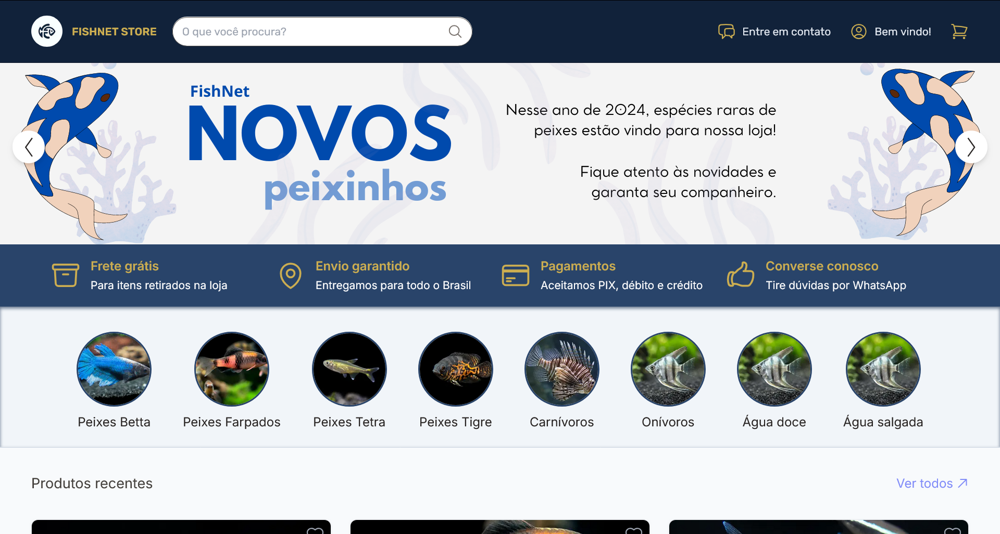
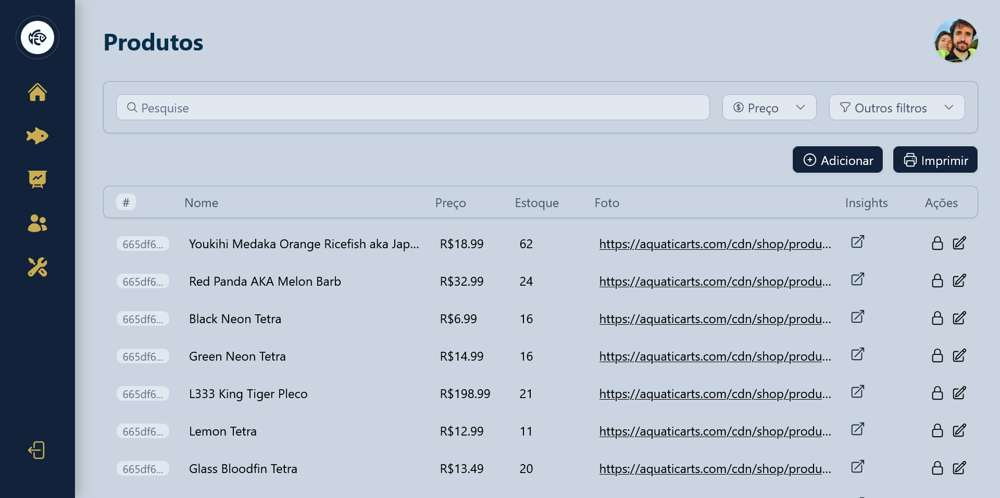

# FishNet

> Parte do projeto integrador de 2024 na Fatec Antonio Russo. Um sistema de gerenciamento de vendas. Repositório é dedicado à interface web, contendo o e-commerce e a dashboard administrativa.

## Prefácio

Este é um projeto [Next.js](https://nextjs.org/). Para rodar a loja localmente, execute `npm run dev` no terminal. As páginas do app são arquivos `page.js` nos diretórios descendentes de `src/app`. As mudanças de qualquer arquivo automaticamente atualizam o servidor.

> [!IMPORTANT]
> Crie um pull request dar merge em uma branch para que um administrador possa realizar revisões necessárias.

## Saiba mais

- [Next.js Documentation](https://nextjs.org/docs) - Documentação do framework Next.js
- [Learn Next.js](https://nextjs.org/learn) - Tutorial interativo
- [Deploying](https://nextjs.org/docs/deployment) - Implantação com Vercel
